# Git Dashboard Visual Plan

> Mermaid 다이어그램 기반 프로젝트 시각화
>
> **Project**: git-dashboard
> **Date**: 2026-03-30
> **Reference**: `git-dashboard-plan.md`, `git-dashboard-design.md`

---

## A. Project Timeline (Gantt Chart)

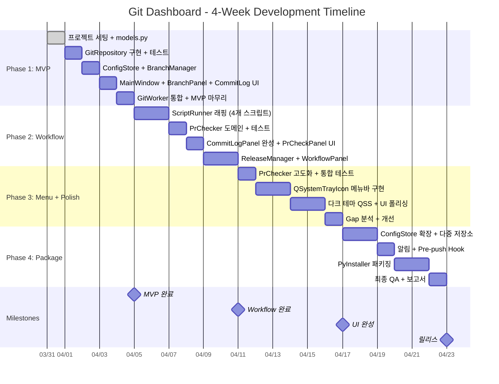

---

## B. 4-Layer Architecture Diagram

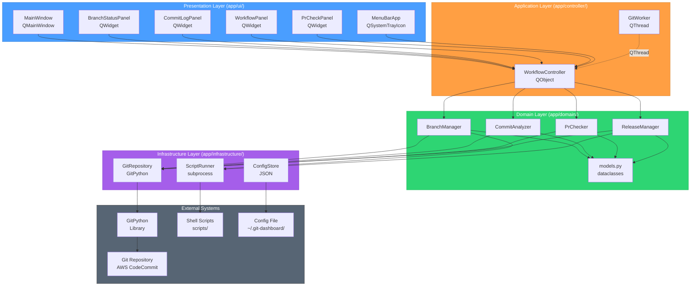

---

## C. Data Flow Diagram (Sequence)

### C.1 브랜치 상태 조회 흐름

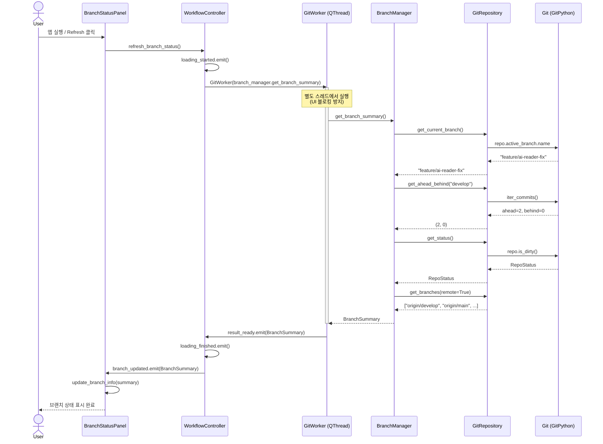

### C.2 develop 동기화 흐름

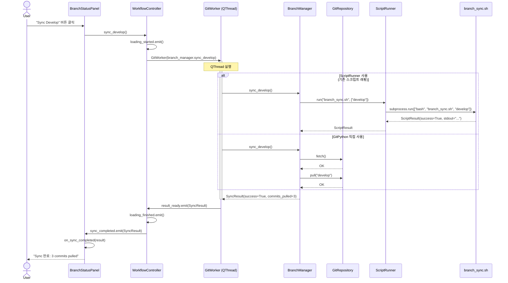

### C.3 PR 품질 체크 흐름

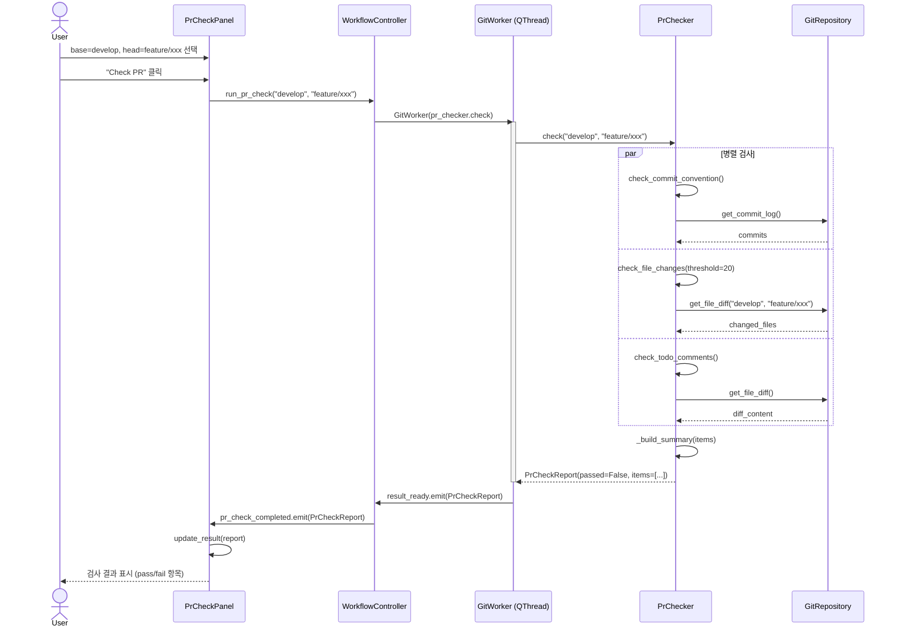

---

## D. Critical Path Diagram (Flowchart)

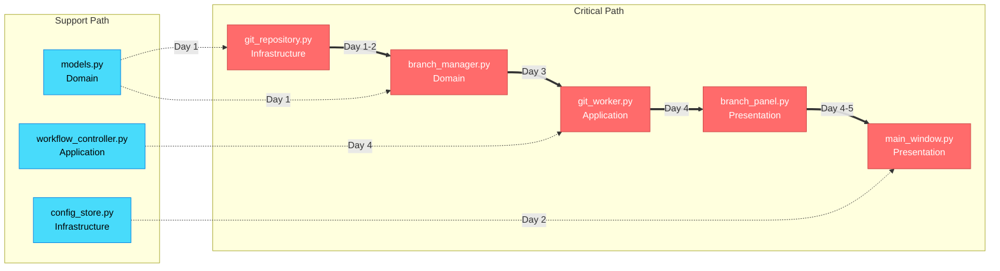

### D.2 전체 프로젝트 의존성 그래프

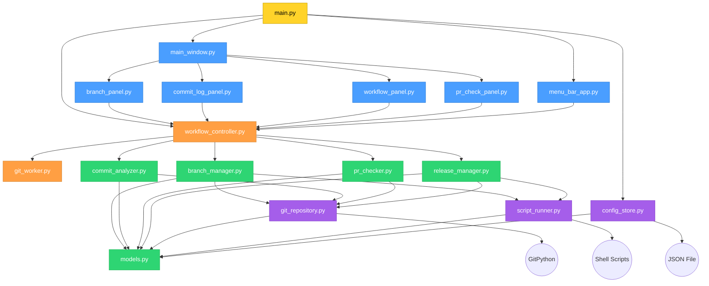

---

## E. Class Diagram

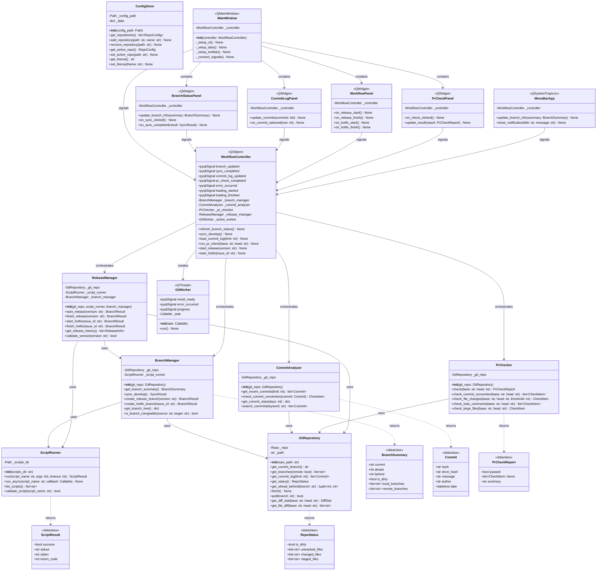

---

## F. Feature-Phase Mapping

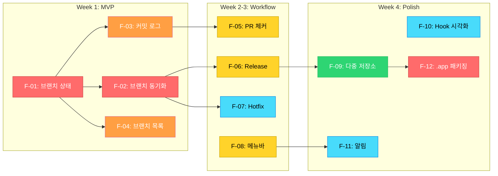

---

## G. PDCA Cycle Flow

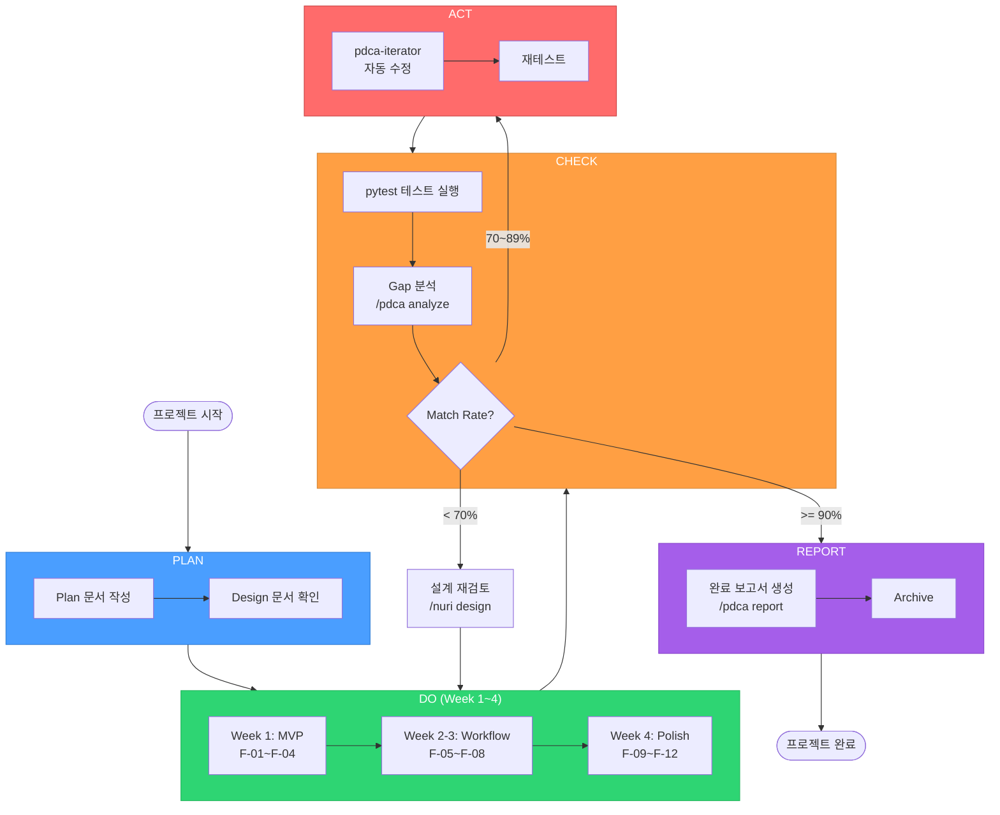

---

## H. Signal/Slot Communication Map

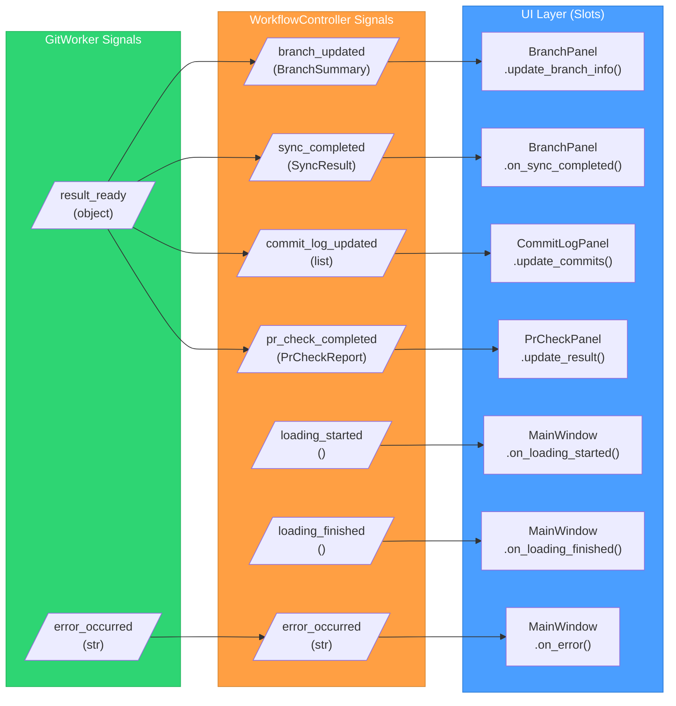

---

## I. Deployment Architecture

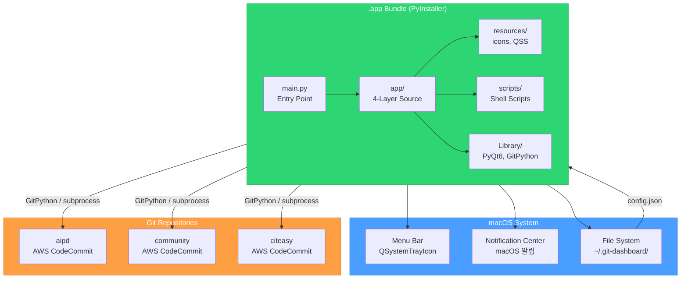

---

*이 문서의 다이어그램은 Mermaid 렌더러가 필요합니다. GitHub, GitLab, VS Code (Mermaid Extension) 등에서 확인 가능합니다.*
